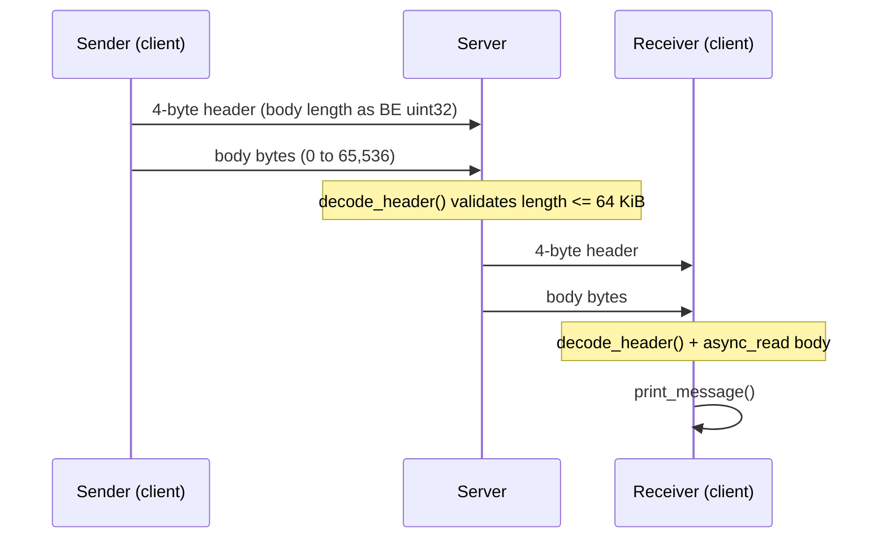
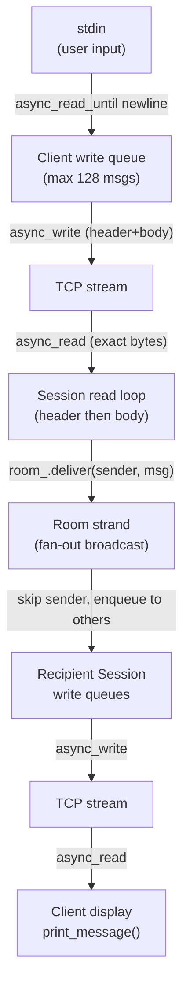
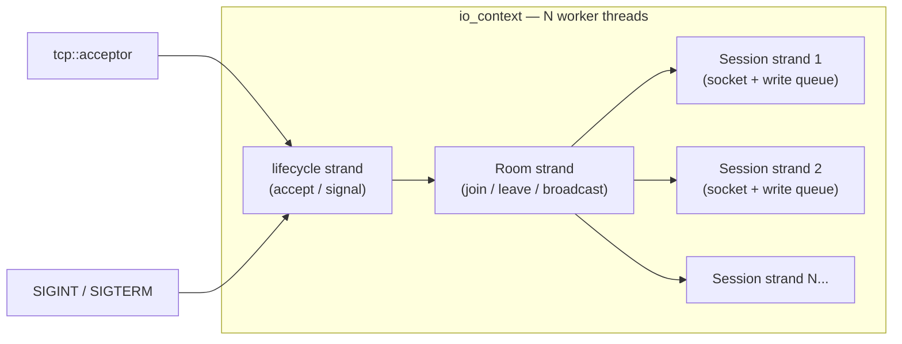
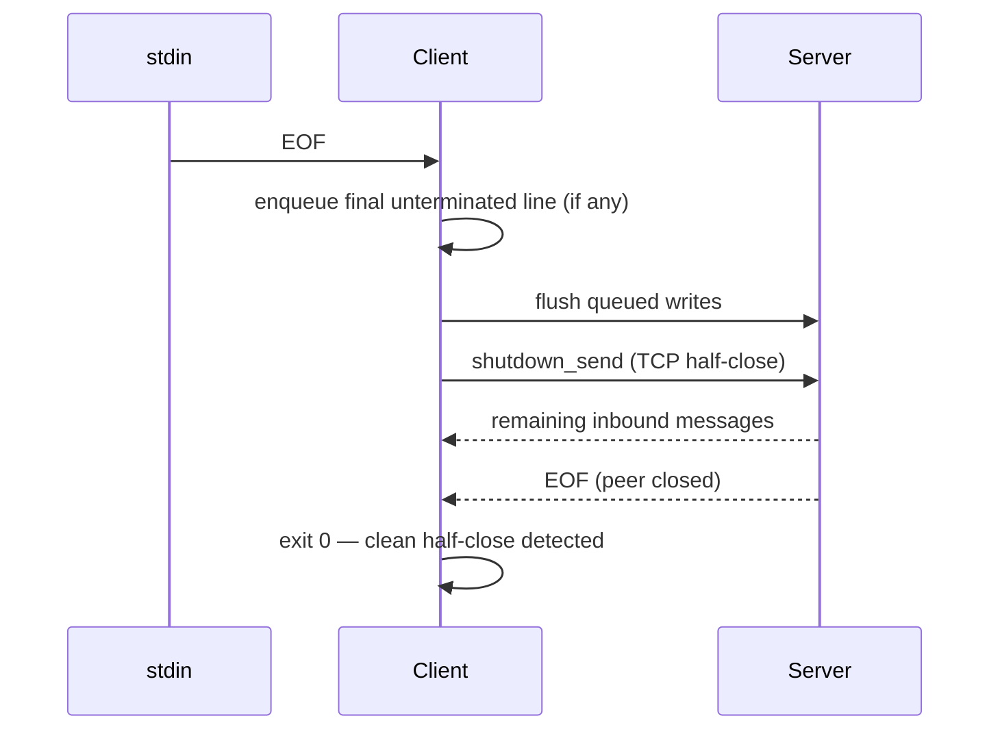
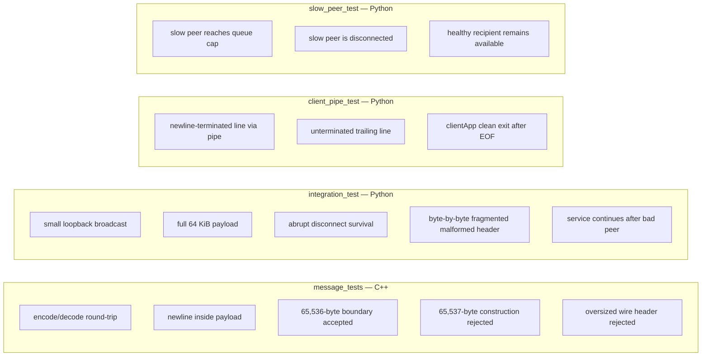
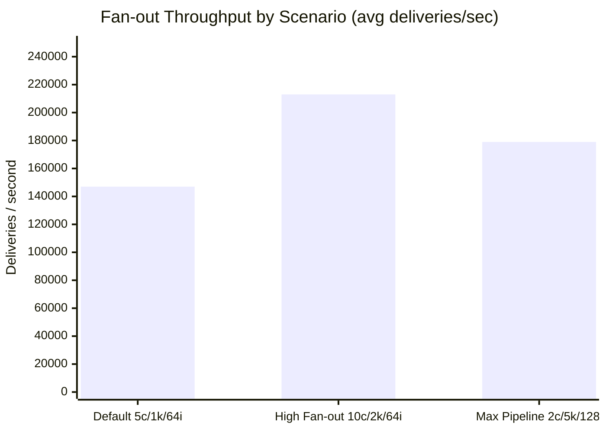
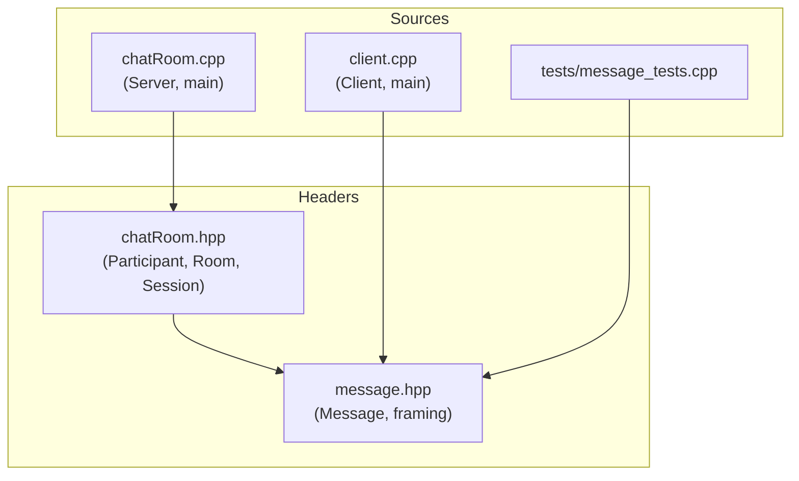

# Asynchronous TCP Chat Server and Client

This is a C++20 TCP chat application built with Boost.Asio. It contains a multi-threaded asynchronous server (`chatApp`) and a terminal client (`clientApp`). Clients send binary-framed messages to the server; the server fans each valid message out to every *other* connected client in the single shared room.

The project is a compact example of framed TCP I/O, asynchronous lifetime management, serialized state with Asio strands, and bounded write queues. It is not an authenticated or encrypted chat service: do not expose it to untrusted networks without adding TLS, authentication, access controls, logging, and operational safeguards.

## Contents

- [Features](#features)
- [Requirements](#requirements)
- [Build](#build)
- [Run the chat](#run-the-chat)
- [Protocol](#protocol)
- [Architecture and concurrency](#architecture-and-concurrency)
- [Client behavior](#client-behavior)
- [Testing](#testing)
- [Benchmarks](#benchmarks)
- [Sanitizers](#sanitizers)
- [Repository layout](#repository-layout)
- [CI and editor support](#ci-and-editor-support)
- [Limits and operational notes](#limits-and-operational-notes)

## Features

- Length-prefixed binary messages, so TCP packet boundaries do not affect parsing.
- Maximum payload size of 64 KiB (65,536 bytes) per message.
- Broadcast to all room participants except the sender.
- A configurable server worker pool powered by one Boost.Asio `io_context`.
- Per-room and per-session Asio strands, preventing concurrent access to shared room state or a session's socket/write queue.
- One outstanding asynchronous write per socket and shared immutable outgoing messages, preserving buffer lifetime.
- TCP keepalive on accepted server connections.
- Backpressure protection: a session with 128 pending outbound messages is disconnected rather than consuming unbounded memory.
- Graceful signal handling: `SIGINT` and `SIGTERM` stop accepting connections and close active sessions.
- Unit, integration, pipe-input regression tests, CI, a loopback benchmark, and optional sanitizers.

## Requirements

| Dependency | Requirement | Why it is needed |
| --- | --- | --- |
| CMake | 3.20 or later | Configures the project and tests. |
| Compiler | C++20-capable compiler | Builds the server, client, and C++ test. |
| Boost | 1.76 or later (1.89 verified) | Provides Asio and endian conversion. |
| Python 3 | Interpreter available to CMake | Runs the integration, backpressure, and client-pipe tests. |
| POSIX environment | macOS or Linux for `clientApp` | The terminal client uses Asio's POSIX stdin descriptor. |

On macOS, Homebrew users can install the main dependencies with:

```sh
brew install boost cmake
```

On Debian/Ubuntu, the CI uses `libboost-all-dev` and `cmake`; install a C++ compiler and Python 3 as well.

## Build

### Make targets

The shortest path is:

```sh
make build
```

This configures a Release build in `build/` and builds all applicable targets in parallel. The available targets are:

| Command | Effect |
| --- | --- |
| `make` or `make build` | Configure and compile a Release build in `build/`. |
| `make test` | Build, then run CTest with failure output. |
| `make benchmark` | Build, then run the loopback fan-out benchmark. |
| `make clean` | Remove the generated `build/` directory. |

### CMake directly

```sh
cmake -S . -B build -DCMAKE_BUILD_TYPE=Release
cmake --build build --parallel
```

The build creates `build/chatApp`. On UNIX platforms it also creates `build/clientApp`; the client target is deliberately omitted on non-POSIX platforms because it depends on `boost::asio::posix::stream_descriptor` for standard input.

## Run the chat

Start the server with a TCP port and, optionally, a positive number of I/O worker threads:

```sh
./build/chatApp 9000 4
```

If the worker count is omitted, the server uses `std::thread::hardware_concurrency()`, with a minimum of one worker. A port of `0` is valid for the server and asks the operating system to select an ephemeral port; the chosen port is printed as `Listening on port <port>`.

Open two or more terminals and connect clients:

```sh
# Defaults to 127.0.0.1 when only a port is supplied.
./build/clientApp 9000

# Connect to a named host explicitly.
./build/clientApp chat.example.com 9000
```

Type a line and press Enter. The server sends it to the other connected clients, whose output is formatted as:

```text
Message: hello from another client
```

The sender does not receive its own message. Stop the server with Ctrl-C; it stops accepting new clients and closes current sessions. The server accepts port values from 0 through 65535. The client requires ports from 1 through 65535.

## Protocol

Each application message is exactly:

```text
+---------------------------+---------------------------+
|    4-byte body length     |        body bytes         |
| uint32, big-endian (BE)   |    0 to 65,536 bytes      |
+---------------------------+---------------------------+
```

The four-byte header stores an unsigned 32-bit body length in network byte order. `Message::decode_header()` rejects any declared length greater than 65,536 bytes (64 KiB) before allocating the body buffer. The body is opaque binary data: it may contain newlines, NUL bytes, or non-UTF-8 data.

TCP is a byte stream, so headers and bodies can be split across reads or combined in one read. Both client and server use `asio::async_read` to obtain the complete fixed-size header and then the exact body length. A malformed or oversized frame causes only that session to close.

The interactive client converts each input line (without its trailing newline) to one frame. It rejects an input line longer than the protocol maximum.

### Protocol framing flow



## Architecture and concurrency

### Message flow overview



### Server internals



`Server` owns the listening acceptor, a retry timer, a signal set, and one `Room`. It schedules accepts on a lifecycle strand. If a non-cancellation accept operation fails, it waits 100 ms before retrying, avoiding a tight loop during transient OS failures or descriptor exhaustion.

`Room` keeps its participants in a `std::set` of shared pointers and confines joins, leaves, broadcasts, and bulk close operations to its own strand. On delivery, it loops over current participants and skips the sender.

Each `Session` owns:

- a TCP socket with keepalive enabled;
- a strand for its read, close, and write-queue operations;
- one `Message` used for the inbound frame;
- a FIFO queue of `std::shared_ptr<const Message>` values for outbound frames; and
- a stopped flag and a 128-message queue cap.

The read loop is header → body → room delivery → next header. A write starts only when the queue transitions from empty to non-empty. Completion removes the front message and starts the next write, so a socket never has competing `async_write` calls. Shared ownership keeps the header and body buffers alive until a write completion handler runs.

`shared_from_this()` is captured by asynchronous handlers, which keeps a session alive while its operations are outstanding. Closing a session shuts down and closes its socket, then requests removal from the room. The use of separate room and session strands means no global mutex is needed even when several `io_context` workers execute callbacks concurrently.

### Session lifecycle

```mermaid
stateDiagram-v2
    [*] --> Connecting : async_accept
    Connecting --> Active : Session::start()
    Active --> Active : read_header then read_body then room.deliver
    Active --> Active : enqueue_write then write_next
    Active --> Stopped : stop() — queue full, socket error, or close_all
    Stopped --> [*] : socket closed and room.leave
```

## Client behavior

`Client` asynchronously connects, reads framed server messages, and reads standard input through a POSIX stream descriptor. Its own strand serializes connection state, stdin callbacks, socket callbacks, and the outbound queue. The client has the same 128-message outbound limit as a server session.

When stdin reaches EOF—such as when input is piped—the client queues any final unterminated line, waits for queued writes to finish, then half-closes the socket's send side. It continues reading until the peer closes, allowing final inbound messages to arrive. A clean EOF after that half-close produces a successful exit.

For terminal-safe output, the client prints printable bytes directly except backslash; it escapes backslash as `\\` and other ASCII control/non-printable bytes as `\xHH`. Bytes at or above `0x80` are emitted unchanged, so valid UTF-8 can display normally.

### Client stdin-EOF drain sequence



## Testing

Run the entire suite:

```sh
make test
# equivalently: ctest --test-dir build --output-on-failure
```

CTest registers the following checks:

| Test | What it verifies |
| --- | --- |
| `message_tests` | Header encoding/decoding, a newline-containing payload, the 64 KiB boundary, construction rejection above the limit, and rejection of an oversized wire header. |
| `integration_test` | Loopback broadcast, a full 64 KiB payload, survival after an abrupt client disconnect, fragmented malformed-header handling, and continued service after rejecting that malformed peer. |
| `slow_peer_test` | A non-reading peer with a constrained receive buffer is evicted after its 128-message outbound queue fills; a healthy recipient continues receiving broadcasts. |
| `client_pipe_test` | Piped stdin is drained: both a newline-terminated line and a final unterminated line reach another client before `clientApp` exits. |

The Python tests start the server on port `0` by default, parse the listening line to discover the selected port, and clean up the child process afterward. You can pass a fixed port when running them directly:

```sh
python3 tests/integration_test.py --server build/chatApp --port 9000
python3 tests/slow_peer_test.py --server build/chatApp --port 9000
python3 tests/client_pipe_test.py --server build/chatApp --client build/clientApp --port 9000
```

### Test coverage map



## Benchmarks

The benchmark tool (`tools/benchmark.py`) starts a two-worker server on loopback, connects the requested clients, pipelines sends in batches of `--inflight` messages, and verifies every received payload before reporting throughput. Results below were collected across two independent runs per scenario to confirm stability.

Run the default scenario:

```sh
make benchmark
# or with explicit parameters:
python3 tools/benchmark.py --server build/chatApp --clients 5 --messages 1000 --inflight 64
```

`--clients` must be ≥ 2 and `--inflight` must be between 1 and 128.

### Environment

| Property | Value |
| --- | --- |
| Machine | Apple M5 |
| OS | macOS 26.6.2 (Build 25G83) |
| CPU cores | 10 |
| Server workers | 2 (as started by the benchmark script) |
| Build type | Release (no sanitizers) |
| Network | loopback (`127.0.0.1`) |

### Results

*Deliveries* = messages × (clients − 1) — the total number of per-recipient message deliveries the fan-out produces.

| Scenario | Clients | Messages | In-flight | Deliveries | Run 1 (del/s) | Run 2 (del/s) | Avg (del/s) | Avg batch time |
| --- | --- | --- | --- | --- | --- | --- | --- | --- |
| Default | 5 | 1,000 | 64 | 4,000 | 151,218 | 143,538 | ~147,000 | ~27 ms |
| High fan-out | 10 | 2,000 | 64 | 18,000 | 214,401 | 211,077 | ~213,000 | ~85 ms |
| Max pipeline | 2 | 5,000 | 128 | 5,000 | 197,929 | 159,751 | ~179,000 | ~28 ms |

> **Note**: Figures represent loopback throughput with short string payloads (`"benchmark-N"`). Larger payloads, more clients, or cross-machine scenarios will yield different numbers. Always record the full command and environment when comparing runs.

### Throughput chart



### Fan-out completion latency

Run the latency benchmark to measure sequential end-to-end loopback fan-out completion latency:

```sh
python3 tools/benchmark.py --server build/chatApp --clients 5 --messages 1000 --latency
```

Each sample starts immediately before the sender issues `sendall()` and completes only after all connected recipient sockets have received and verified the message frame.

| Scenario | Clients | Receivers | Messages | Avg Latency | p50 Latency | p95 Latency | p99 Latency |
| --- | --- | --- | --- | --- | --- | --- | --- |
| 2-client loopback | 2 | 1 | 2,000 | ~0.037 ms | ~0.027 ms | ~0.075 ms | ~0.104 ms |
| 5-client loopback | 5 | 4 | 1,000 | ~0.058 ms | ~0.045 ms | ~0.102 ms | ~0.124 ms |

## Sanitizers

CMake supports AddressSanitizer plus UndefinedBehaviorSanitizer, or ThreadSanitizer. They cannot be enabled together and require Clang or GCC rather than MSVC.

```sh
# Memory and undefined-behavior checks
cmake -S . -B build-asan -DCMAKE_BUILD_TYPE=Debug -DENABLE_ASAN=ON
cmake --build build-asan --parallel
ctest --test-dir build-asan --output-on-failure

# Thread-race checks
cmake -S . -B build-tsan -DCMAKE_BUILD_TYPE=Debug -DENABLE_TSAN=ON
cmake --build build-tsan --parallel
ctest --test-dir build-tsan --output-on-failure
```

## Repository layout

| Path | Purpose |
| --- | --- |
| `message.hpp` | Header-only `Message` type and the binary framing rules. |
| `chatRoom.hpp` | `Participant`, `Room`, and `Session` declarations. |
| `chatRoom.cpp` | Server implementation, accept retry behavior, signal shutdown, and server CLI. |
| `client.cpp` | POSIX terminal client, asynchronous input/output, and client CLI. |
| `CMakeLists.txt` | CMake targets, Boost/Threads discovery, warnings, sanitizers, installation, and CTest registration. |
| `Makefile` | Convenience build, test, benchmark, and clean targets. |
| `tests/message_tests.cpp` | C++ framing unit test. |
| `tests/integration_test.py` | Socket-level server integration test. |
| `tests/slow_peer_test.py` | Slow-consumer eviction and healthy-peer survival regression test. |
| `tests/client_pipe_test.py` | Regression test for stdin EOF and queued client writes. |
| `tools/benchmark.py` | Configurable loopback fan-out benchmark. |
| `.github/workflows/c-cpp.yml` | GitHub Actions release and ASan/UBSan build-and-test matrix. |
| `.vscode/launch.json` | LLDB launch configuration for a server on port 9099. |
| `.vscode/settings.json` | C++ file associations for editor IntelliSense. |
| `.gitignore` | Excludes generated build products, local binaries, Python caches, and macOS metadata. |

### Module dependency graph



## CI and editor support

GitHub Actions runs on pushes and pull requests to `main`. It installs Boost and CMake on Ubuntu (`libboost-all-dev`), then builds and tests three configurations:

| Matrix job | CMake flags | What it checks |
| --- | --- | --- |
| `release` | `-DCMAKE_BUILD_TYPE=Release` | Optimized build plus all four CTest checks |
| `asan-ubsan` | `-DCMAKE_BUILD_TYPE=Debug -DENABLE_ASAN=ON` | AddressSanitizer + UndefinedBehaviorSanitizer |
| `tsan` | `-DCMAKE_BUILD_TYPE=Debug -DENABLE_TSAN=ON` | ThreadSanitizer race detection |

For VS Code, open the project folder, build it first, then select **Launch chat server**. The supplied LLDB configuration starts `build/chatApp` with port `9099` in the workspace directory.

## Limits and operational notes

- There is exactly one room; no usernames, rooms, history, persistence, authentication, encryption, or authorization layer exists.
- Broadcast excludes the sender. A client that needs local echo must print its own input separately.
- A server session or client whose outbound queue reaches 128 pending messages is closed. With maximum-sized payloads, that caps queued message bodies at roughly 8 MiB per connection, plus object and container overhead.
- A peer that sends a header declaring more than 65,536 bytes (64 KiB) is disconnected. No unbounded allocation occurs from a peer-provided length.
- The server accepts only IPv4 (`tcp::v4()`).
- Protocol bodies are binary, but the supplied client is line-oriented and has output escaping behavior described above.
- The server's log output is intentionally minimal: it prints its listening port and errors that escape startup/main. Add structured observability before production use.
